# Financial Intelligence Agent: Hybrid AI for AML 🛡️


> **A real-time Anti-Money Laundering (AML) system that synergizes Unsupervised Learning (Isolation Forest) for anomaly detection with Large Language Models (LLMs) for automated investigative reporting.**

---

## 📋 Executive Summary

Financial institutions face a massive volume of transactions, making manual review impossible. This project creates an **autonomous surveillance layer** that:

1. **Filters noise:** Uses statistical ML to identify the top 1% of statistical anomalies in real-time.  
2. **Automates compliance:** Uses a Generative AI Agent to draft Suspicious Activity Reports (SARs) instantly, reducing analyst workload by ~90%.

**Key Innovation:** Combining the *speed and statistical rigor* of classical ML with the *reasoning and natural language* capabilities of modern LLMs.

---

## 🧠 Data Science & AI Architecture

### 1. Anomaly Detection Engine (The "Predictive" Layer)

- **Algorithm:** Isolation Forest (Unsupervised Learning)  
- **Why Unsupervised?** Fraud patterns evolve rapidly; supervised models require labeled data which is often scarce or outdated. Isolation Forest effectively isolates rare events in high-dimensional feature space.  
- **Feature Engineering:**
  - Constructed `errorBalanceOrig` and `errorBalanceDest` to detect discrepancies between transaction amounts and balance changes (a hallmark of fraud).
  - Encoded transaction types (`CASH_OUT`, `TRANSFER`, etc.).
- **Training Pipeline:** `scikit-learn` pipeline with `StandardScaler` for data normalization.

### 2. GenAI Compliance Agent (The "Generative" Layer)

- **Model:** Google Gemini 1.5 Flash  
- **Role:** Acts as a Senior Compliance Analyst  
- **Agentic Workflow:**
  1. Receives raw transaction data flagged by the Isolation Forest.
  2. Analyzes context (sender/receiver history, amounts).
  3. **Structured Output:** Generates a formal SAR (Suspicious Activity Report) compliant with financial regulations (PPATK/FinCEN-style narrative).

---

## 🛠️ Technical Stack

| Domain        | Tech Stack                     | Purpose                                      |
|---------------|--------------------------------|----------------------------------------------|
| **ML Core**   | `Scikit-learn`, `Pandas`, `Joblib` | Anomaly detection model training & inference |
| **GenAI**     | `Google Gemini API`            | Natural language explanation & report generation |
| **Backend**   | `FastAPI`, `Uvicorn`           | Asynchronous API handling real-time data streams |
| **Streaming** | `SSE (Server-Sent Events)`     | Pushing live transactions to the dashboard   |
| **Frontend**  | `React.js`                     | Interactive dashboard for analysts           |
| **DevOps**    | `Docker`, `Docker Compose`     | Containerized deployment for reproducibility |

---

## 🔧 System Architecture

```mermaid
graph LR
    A[💸 Live Transaction Stream] -->|Ingest| B(FastAPI Backend)
    B -->|Preprocessing| C{Isolation Forest Model}
    C -->|Normal| D[Log & Ignore]
    C -->|Anomaly Detected!| E[🚩 Flag Transaction]
    E -->|Trigger Agent| F[Gemini LLM]
    F -->|Reasoning| G[Generate Explanation]
    F -->|Action| H[Draft SAR Report]
    E & G & H -->|SSE Push| I[Analyst Dashboard]
```



---

## 💻 How to Run Locally

This project is fully containerized.

### Prerequisites
- Docker & Docker Compose
- Google Gemini API Key

### Steps

1. **Clone the Repo**
   ```bash
   git clone https://github.com/yourusername/hybrid-ai-fraud-detection.git
   cd hybrid-ai-fraud-detection
   ```

2. **Environment Setup**  
   Create a `.env` file in the root directory:
   ```env
   GEMINI_API_KEY=your_api_key_here
   ```

3. **Train the Model** (Optional – a pre-trained model is included)
   ```bash
   cd backend
   python app/train_model.py
   cd ..
   ```

4. **Launch with Docker**
   ```bash
   docker-compose up --build
   ```

- **Frontend:** [http://localhost:3000](http://localhost:3000)  
- **Backend API Docs:** [http://localhost:8088/docs](http://localhost:8088/docs)

---

## 🔍 Code Highlights

### Feature Engineering for Fraud

One of the most powerful indicators of fraud in this dataset is when the transaction amount doesn't match the change in account balance.

```python
# From backend/app/main.py
def preprocess_transaction(tx: pd.DataFrame):
    # Creating 'error' features to capture balance discrepancies
    tx['errorBalanceOrig'] = tx['newbalanceOrg'] + tx['amount'] - tx['oldbalanceOrg']
    tx['errorBalanceDest'] = tx['oldbalanceDest'] + tx['amount'] - tx['newbalanceDest']
    return tx
```

### Prompt Engineering for SAR Generation

We enforce a strict persona on the LLM to ensure professional, regulation-compliant output.

```python
# From backend/app/main.py
prompt = f"""
You are a professional financial compliance analyst writing a Suspicious Activity Report (SAR).
Based on the following JSON transaction data, write a clear, formal, and concise narrative.
...
7. Recommendation: Suggest next steps (Freeze account, etc).
"""
```

---

## 🚀 Future Roadmap

- **Graph Neural Networks (GNN):** Detect fraud rings by analyzing relationships between accounts, not just isolated transactions.  
- **Feedback Loop:** Allow analysts to mark "False Positives" on the dashboard to retrain and fine-tune the Isolation Forest model.  
- **Vector Database:** Store past fraud cases in a vector DB (e.g., Pinecone) to enable the LLM to reference historical precedents using RAG.

---